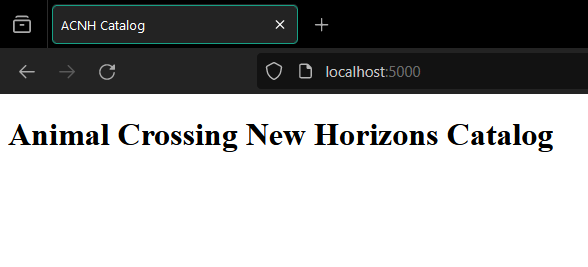
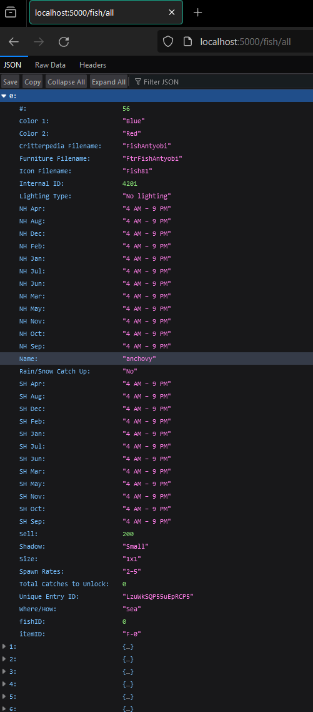
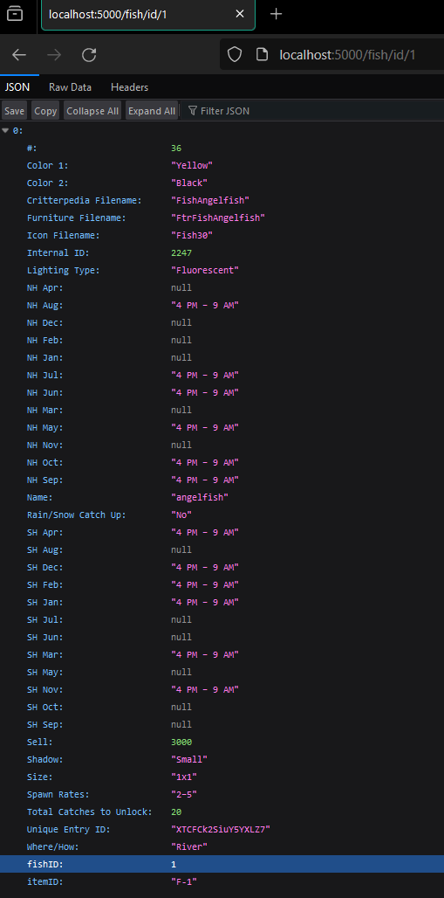
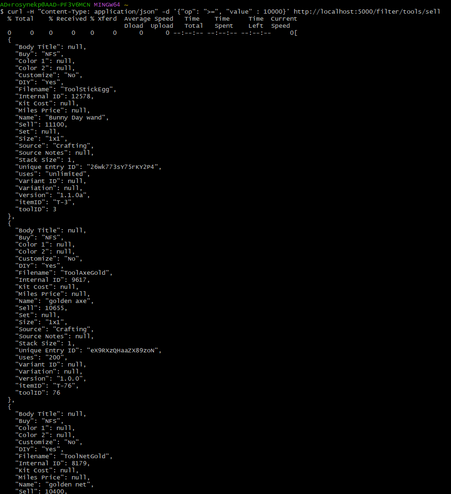
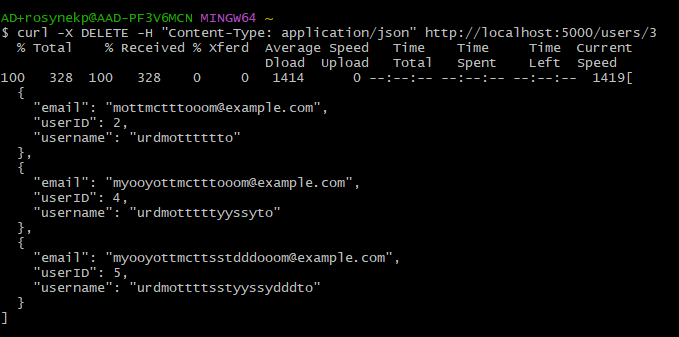
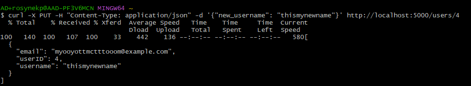

Animal Crossing Data from: https://www.kaggle.com/datasets/jessicali9530/animal-crossing-new-horizons-nookplaza-dataset?resource=download

## **API Description**

The following endpoints are supported:

| Endpoint            | Method | 
|---------------------|--------| 
| /                   | GET    | 
| /fish/all           | GET    | 
| /fish/id/\<fishID>   | GET    | 
| /fish/name          | GET    | 
| /filter/fish/sell   | POST   | 
| /insects/all        | POST   | 
| /insects/id/\<insectID>| GET   | 
| /insect/name        | GET    | 
| /filter/insect/sell | POST   | 
| /tools/all          | POST   | 
| /tools/id/\<fishID>  | GET    | 
| /tools/name         | GET    | 
| /filter/tools/sell  | POST   | 
| /users/all          | POST   | 
| /users/create       | GET    | 
| /users/\<userID>     | POST   | 
| /users/\<userID>     | DELETE | 
| /users/\<userID>     | GET    | 
| /users/\<userID>     | PUT    | 

## **Local Application**

Note: Due to the large number of endpoints I only took screenshots of a few of the most important ones.

### GET /

### GET /fish/all

### GET /fish/id/1 

### POST /filter/tools/sell

curl -H "Content-Type: application/json" -d '{"op": ">=", "value" : 10000}' http://localhost:5000/filter/tools/sell

### DELETE /users/\<userID>
curl -X DELETE -H "Content-Type: application/json" http://localhost:5000/users/3

### PUT /users/\<userID>
curl -X PUT -H "Content-Type: application/json" -d '{"new_username": "thismynewname"}' http://localhost:5000/users/4

'

## **Dockerize Application**

### Docker Image
url: 

### Docker Hub
