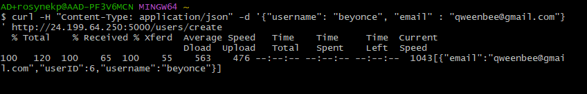
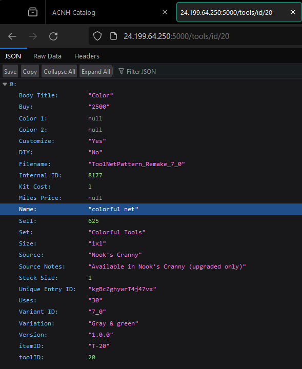

# **Lab 08 - Flask API: Docker, DigitalOcean, & Kubernetes**
#### Paige Rosynek
#### CSC 5201 301
#### Dr. Jay Urbain
#### 03.06.2024

## **API Description**

The API built for this lab is used to serve data on the fish, insects, and tools from the game Animal Crossing: New Horizons. Animal Crossing is a casual nintendo game where the player is tasked with reviving and developing a deserted island. On the island, users can: catch creatures like fish, insects, and sea creatures, craft tools, talk to villagers, plant trees, and more. In addition, users can sell the creatures that they catch for bells, which can be used to buy and upgrade items in the game. However, factors such as the time of year, time of day, and hemisphere all influence when certain creatures can be caught. Therefore, the purpose of this API is to allow the user to retrieve and filter information on the fish, insects, and tools from Animal Crossing.  

The application consists of a REST API that queries a SQL database. The database consists of the following tables: fish, insects, tools, and users. The first three tables are populated from a corresponding csv file containing the specific Animal Crossing data. The data used to create these tables is publicly available on Kaggle ( https://www.kaggle.com/datasets/jessicali9530/animal-crossing-new-horizons-nookplaza-dataset?resource=download ). The data from the csv files are loaded into SQL tables to allow for the API to query the data. 

The API supports the following endpoints:

| Endpoint            | Method | Description | 
|---------------------|--------| --------|
| /                   | GET    | Returns home page |
| /fish/all           | GET    | Returns all fish records |
| /fish/id/\<fishID>   | GET    | Returns matching record for \<fishID> |
| /fish/name          | POST    | Returns matching record the given params: {'name' : '\<fish name>'} |
| /filter/fish/sell   | POST   | Returns all records with data that meets the search criteria: {'op' : '\<operator>', 'value' : '\<value>'} |
| /insects/all        | GET   |  Returns all insect records |
| /insects/id/\<insectID>| GET   | Returns matching record for \<insectID> |
| /insect/name        | POST   | Returns matching record the given params: {'name' : '\<insect name>'} |
| /filter/insect/sell | POST   | Returns all records with data that meets the search criteria: {'op' : '\<operator>', 'value' : '\<value>'} |
| /tools/all          | GET  | Returns all tool records |
| /tools/id/\<toolID>  | GET    | Returns matching record for \<toolID> |
| /tools/name         | POST   | Returns matching record the given params: {'name' : '\<tool name>'} |
| /filter/tools/sell  | POST   | Returns all records with data that meets the search criteria: {'op' : '\<operator>', 'value' : '\<value>'} |
| /users/all          | GET  | Returns all user records |
| /users/create       | POST    | Creates a user and adds it to the database. params {'username' : '\<username>', 'email' : '\<email>'} |
| /users/\<userID>     | DELETE | Deletes user from database by \<userID> |
| /users/\<userID>     | GET    | Returns matching record for \<userID> |
| /users/\<userID>     | PUT    | Updates userID's username. params: {'new_username' : '\<username>'} |

This API allows the user to retrieve and filter all of the fish, insects, and tools from Animal Crossing: New Horizons. Each type of item can be retrieved by its ID or name and can be filtered by the selling price. The supported operations for filtering an item are: '=', '>', '>=', '<', '<=', and '<>'. In addition, the API supports the creation, deletion, and editing of users. A user can be created by creating a POST request that defines the properties: 'username' and 'email'. A user's username can be changed with a PUT request to /users/\<userID> that defines the property 'new_username'. A user can be deleted by its userID by sending a DELETE request to /users/\<userID>. Due to time constraints and the scope of the project, I was unable to complete the functionality that would allow a user to save and unsave items (fish, insects, tools) by id to their account. 

The structure and functionality of the API is inspired by the tutorial written by Bhavani Ravi( https://medium.com/bhavaniravi/build-your-1st-python-web-app-with-flask-b039d11f101c ).

## **Local Application**

Note: Due to the large number of endpoints I only took screenshots of a few of the more important ones.

### GET /

### GET /fish/all

### GET /fish/id/1 

### POST /filter/tools/sell

curl -H "Content-Type: application/json" -d '{"op": ">=", "value" : 10000}' http://localhost:5000/filter/tools/sell

### DELETE /users/\<userID>
curl -X DELETE -H "Content-Type: application/json" http://localhost:5000/users/3

### PUT /users/\<userID>
curl -X PUT -H "Content-Type: application/json" -d '{"new_username": "thismynewname"}' http://localhost:5000/users/4

'

## **Dockerize Application**

### Docker Image
url: https://hub.docker.com/repository/docker/rosynekp/lab08/general

### Docker Hub
'

## **Deployed Application - All Endpoints**

### Deploy - Command Line
'

### GET /
'

### GET /users/all
'

### GET /users/\<userID>

### POST /users/create
curl -H "Content-Type: application/json" -d '{"username": "beyonce", "email" : "qweenbee@gmail.com"}' http://24.199.64.250:5000/users/create\

### DELETE /users/\<userID>
curl -X DELETE -H "Content-Type: application/json" http://24.199.64.250:5000/users/5

### PUT /users/\<userID>
curl -X PUT -H "Content-Type: application/json" -d '{"new_username": "overlord"}' http://24.199.64.250:5000/users/6

### GET /fish/all

### GET /insects/all

### GET /tools/all

### GET /fish/id/\<fishID>

### GET /insects/id/\<insectID>

### GET /tools/id/\<toolID>

### POST /fish/name
curl -H "Content-Type: application/json" -d '{"name": "black bass"}' http://24.199.64.250:5000/fish/name

### POST /insects/name
curl -H "Content-Type: application/json" -d '{"name": "banded dragonfly"}' http://24.199.64.250:5000/insect/name

### POST /tools/name
curl -H "Content-Type: application/json" -d '{"name": "net"}' http://24.199.64.250:5000/tools/name

### POST /filter/fish/sell
curl -H "Content-Type: application/json" -d '{"op": ">=", "value" : 15000}' http://24.199.64.250:5000/filter/fish/sell

### POST /filter/insects/sell
curl -H "Content-Type: application/json" -d '{"op": "<=", "value" : 100}' http://24.199.64.250:5000/filter/insect/sell

### POST /filter/tools/sell
curl -H "Content-Type: application/json" -d '{"op": "=", "value" : 100}' http://24.199.64.250:5000/filter/tools/sell

## **Lab Feedback**

Overall, I think that this lab provided a valuable experience in the areas of writing a simple API, dockerizing a Flask application, and deploying a containerized image to a Kubernetes cluster running on a cloud provider, like DigitalOcean. I liked that we were given the freedom to develop any type of application we wanted, however this also became one of the biggest challenges of the project since I struggled to come up with an idea that was of equal scope to the provided example. Having to design and implement our own API was a valuable exercise and challenge; I spend a lot of my time coding in Jupyter Notebooks which does not often require any complex design patterns or design principles. However, I found the provided example project to be a good reference on how to design my application. In this lab, I used the sqlite3 python library to create and manage the database which I found to be easier to deploy than the mysql equivalent that was done in lab 7. One challenge I faced throughout this lab was with the deployment.yaml and service.yaml files. I had been using these files from previous labs as a reference to help create them for my API, however somewhere in the copy-paste of it all I had defined the wrong ports for the application to listen on. In my Dockerfile I had the application running on port 5000, however in my deployment.yaml and service.yaml files I had used 8000. This caused the external IP of the running Kubernetes application to timeout. However, after a an hour of debugging I had realized my mistake and used port 5000 throughout the deployment and service files. Although, this error was frustrating, it forced me to slow down and better understand how Kubernetes, Docker, and DigitalOcean worked together to serve my application. In general, this lab served as a valuable learning experience on how to design, implement, and deploy a Flask application to a Kubernetes cluster hosted in the cloud.
